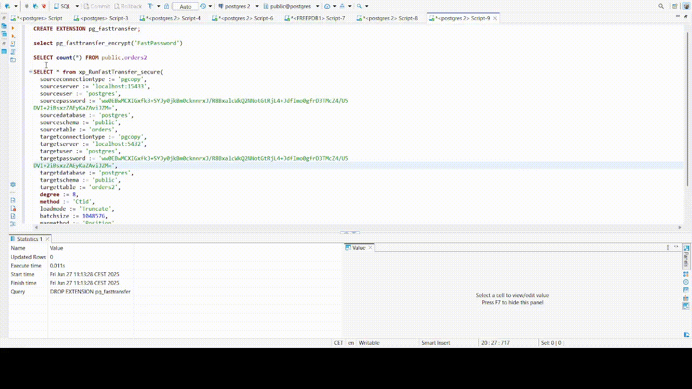

# pg_fasttransfer

A PostgreSQL extension to run the [FastTransfer](https://www.arpe.io/fasttransfer/?v=82a9e4d26595) tool from an SQL function, enabling fast data transfer between databases.




## Table of Contents

* [Prerequisites](#prerequisites)

  * [Linux](#linux)

  * [Windows](#windows)

    * [Required Workload](#required-workload)

    * [Individual Components to Select](#individual-components-to-select)

    * [Installation Steps](#installation-steps)

* [Installation](#installation)

  * [Linux](#linux-1)

  * [Windows](#windows-1)

* [SQL Setup](#sql-setup)

  * [Drop existing extension](#drop-existing-extension-if-any)

  * [Create the extension](#create-the-extension)

* [Function: pg_fasttransfer_encrypt](#function-pg_fasttransfer_encrypt)

* [Function: xp_RunFastTransfer_secure Usage](#function-xp_runfasttransfer_secure-usage)

  * [Linux example](#linux-exemple)

  * [Windows example](#windows-exemple)

* [Function Return Structure](#function-return-structure)

* [Notes](#notes)

## Prerequisites

* PostgreSQL installed with development headers

* Administrator privileges (sudo on Linux, appropriate rights on Windows)

### Linux

* `gcc` or `clang` (C compiler)

* `make`

### Windows

You need to install the **C/C++ compiler** and required build tools using **Build Tools for Visual Studio 2022**.

#### Required Workload

* **C++ build tools** (main workload)

#### Individual Components to Select

| **Component Group** | **Specific Items to Select** | **Description** |
|---|---|---|
| **MSVC Compiler** | ✅ *MSVC v143 - VS 2022 C++ x64/x86 build tools (Latest)* | The core C++ compiler |
| **Windows SDK** | ✅ *Windows 10 SDK (10.0.19041.0)* or *Windows 11 SDK* | Headers and libraries |
| **Additional Tools** | ✅ *CMake tools for Visual Studio*<br>✅ *MSBuild support for LLVM toolset* | Optional, but helpful for broader compatibility |

#### Installation Steps

1. Download [**Build Tools for Visual Studio 2022**](https://visualstudio.microsoft.com/visual-cpp-build-tools/) from the official Microsoft website.

2. Launch the installer.

3. Select the **C++ build tools** workload.

4. On the right-hand panel, check the individual components listed above.

5. Install.

## Installation

### Linux

1. **Stop PostgreSQL**

```bash
sudo systemctl stop postgresql
```

2. **Remove any existing installation**

```bash
sudo rm -f /usr/lib/postgresql/*/lib/pg\_fasttransfer.so
sudo rm -f /usr/share/postgresql/*/extension/pg\_fasttransfer\*
```

3. **Build and install**

```bash
make clean && make && sudo make install
```

4. **Restart PostgreSQL**

```bash
sudo systemctl start postgresql
```

### Windows

1. Open **x64 Native Tools Command Prompt for VS 2022** (or equivalent).

2. Ensure `pg_config` is available in your `PATH`.

3. Run the build script in the project directory:

```powershell
build_for_windows.bat
```

This script will:

* Verify required tools (compiler, pg_config)

* Compile and link the extension DLL

* Copy the extension files to the appropriate PostgreSQL directories

4. Restart the PostgreSQL service.

## SQL Setup

### Drop existing extension (if any)

```sql
DROP EXTENSION IF EXISTS pg_fasttransfer CASCADE;
```

### Create the extension

```sql
CREATE EXTENSION pg_fasttransfer;
```

## Function: pg_fasttransfer_encrypt

This function encrypts a given text string using `pgp_sym_encrypt` and encodes the result in base64. This is useful for storing sensitive information, such as passwords, in a secure manner within your SQL scripts or configuration. The `xp_RunFastTransfer_secure` function will automatically decrypt any values passed to its `--sourcepassword` and `--targetpassword` arguments using the same encryption key. **The encryption/decryption key is defined by the `PGFT_ENCRYPTION_KEY` variable in the C source file (`pg_fasttransfer.c`) and can be changed by recompiling the extension.**

**Syntax:**

```sql
pg_fasttransfer_encrypt(text_to_encrypt text) RETURNS text
```

**Example:**

```sql
SELECT pg_fasttransfer_encrypt('MySecurePassword');
-- Returns: A base64-encoded encrypted string, e.g., "PgP...base64encodedstring=="
```

## Function: xp_RunFastTransfer_secure Usage

This is the main function to execute the FastTransfer tool. It takes various parameters to configure the data transfer operation. Password arguments (`sourcepassword`, `targetpassword`) will be automatically decrypted if they were encrypted using `pg_fasttransfer_encrypt`.

**Syntax:**

```sql
xp_RunFastTransfer_secure(
sourceconnectiontype text DEFAULT NULL,
sourceconnectstring text DEFAULT NULL,
sourcedsn text DEFAULT NULL,
sourceprovider text DEFAULT NULL,
sourceserver text DEFAULT NULL,
sourceuser text DEFAULT NULL,
sourcepassword text DEFAULT NULL, 
sourcetrusted boolean DEFAULT FALSE,
sourcedatabase text DEFAULT NULL,
sourceschema text DEFAULT NULL,
sourcetable text DEFAULT NULL,
query text DEFAULT NULL,
fileinput text DEFAULT NULL,
targetconnectiontype text DEFAULT NULL,
targetconnectstring text DEFAULT NULL,
targetserver text DEFAULT NULL,
targetuser text DEFAULT NULL,
targetpassword text DEFAULT NULL, 
targettrusted boolean DEFAULT FALSE,
targetdatabase text DEFAULT NULL,
targetschema text DEFAULT NULL,
targettable text DEFAULT NULL,
degree integer DEFAULT NULL,
method text DEFAULT NULL,
distributekeycolumn text DEFAULT NULL,
datadrivenquery text DEFAULT NULL,
loadmode text DEFAULT NULL,
batchsize integer DEFAULT NULL,
useworktables boolean DEFAULT FALSE,
runid text DEFAULT NULL,
settingsfile text DEFAULT NULL,
mapmethod text DEFAULT NULL,
license text DEFAULT NULL,
fasttransfer_path text DEFAULT NULL
) RETURNS RECORD
```

### Linux example

```sql
SELECT * FROM xp_RunFastTransfer_secure(
targetconnectiontype := 'msbulk',
sourceconnectiontype := 'pgsql',
sourceserver := 'localhost:5432',
sourceuser := 'pytabextract_pguser',
sourcepassword := pg_fasttransfer_encrypt('MyActualPassword'), 
sourcedatabase := 'tpch',
sourceschema := 'tpch_1',
sourcetable := 'orders',
targetserver := 'localhost,1433',
targetuser := 'migadmin',
targetpassword := pg_fasttransfer_encrypt('AnotherSecurePassword'), 
targetdatabase := 'target_db',
targetschema := 'tpch_1',
targettable := 'orders',
loadmode := 'Truncate',
license := '/tmp/FastTransfer_linux-x64_v0.13.5/FastTransfer.lic',
fasttransfer_path := '/tmp/FastTransfer_linux-x64_v0.13.5'
);
```

### Windows example

```sql
SELECT * from xp_RunFastTransfer_secure(
sourceconnectiontype := 'mssql',
sourceserver := 'localhost',
sourcepassword := pg_fasttransfer_encrypt('MyWindowsPassword'),
sourceuser := 'FastLogin',
sourcedatabase := 'tpch10',
sourceschema := 'dbo',
sourcetable := 'orders',
targetconnectiontype := 'pgcopy',
targetserver := 'localhost:15433',
targetuser := 'postgres',
targetpassword := pg_fasttransfer_encrypt('MyPostgresPassword'), 
targetdatabase := 'postgres',
targetschema := 'public',
targettable := 'orders',
method := 'Ntile',
degree := 12,
distributekeycolumn := 'o_orderkey',
loadmode := 'Truncate',
batchsize := 1048576,
mapmethod := 'Position',
fasttransfer_path := 'D:\sources\FastTransfer'
);
```

## Function Return Structure

| **Column** | **Type** | **Description** |
|---|---|---|
| exit_code | integer | FastTransfer process exit code |
| output | text | Full FastTransfer logs |
| total_rows | bigint | Total rows transferred (-1 if not found) |
| total_columns | integer | Total columns transferred (-1 if not found) |
| transfer_time_ms | bigint | Transfer time in milliseconds (-1 if not found) |
| total_time_ms | bigint | Total time in milliseconds (-1 if not found) |

## Notes

* On Windows, the `build_for_windows.bat` script must be run from a **Developer Command Prompt for Visual Studio** where the compiler is available.

* The extension uses `pg_config` to locate PostgreSQL paths.

* `.control` and `.sql` files are installed automatically via the Makefile or Windows build script.

* **To change the encryption/decryption key, edit the `PGFT_ENCRYPTION_KEY` static variable in the `pg_fasttransfer.c` source file and recompile the extension.**
